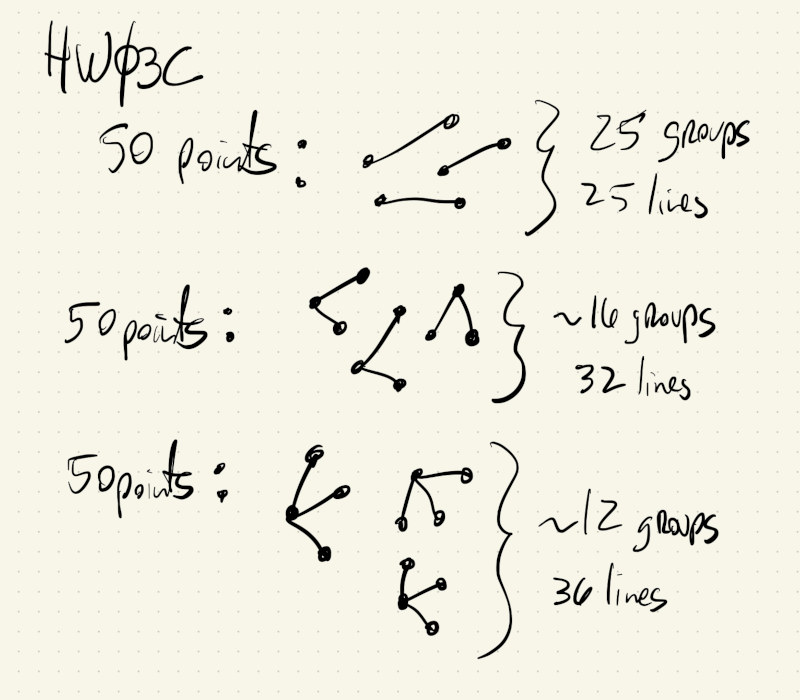
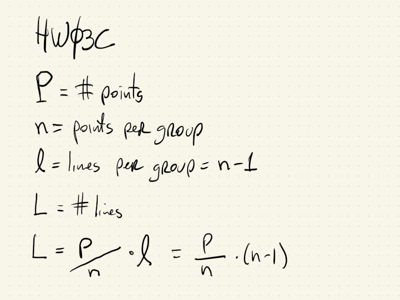
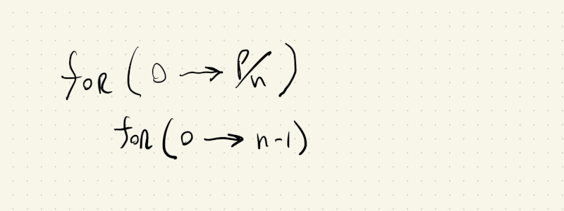

# HW03C

This is a sketch that implements Sol LeWitt's Wall Drawing 118:


To me, the instructions are kind of ambiguous about the relationship between lines and points (which is part of the fun of these Wall Drawings). It's not clear if the 50 points are fully connected amongst themselves, or if each point just has to have one connection to another point, or if the points should have multiple connections, but not be fully connected...

My interpretation was that each point should have at least one line, and that they can be in clusters, like in the following sketch, where some points have one line and other have multiple lines:



I also wanted my sketch to have parameters so I can control the number of points and the size of the groups. By defining ```P``` to be the total number of points (at least 50) and ```n``` to be the number of points per groups, or the number of neighbors, I can derive the following equations for the total number of lines:



I can easily implement this parametrized version by using a set of nested ```for()``` loops. The outer loop goes from $0$ to $P \ over n$ (which is the total number of groups in the drawing), and the inner loop iterates from $0$ to $n - 1$ (which is the number of lines in a group):


